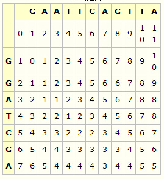
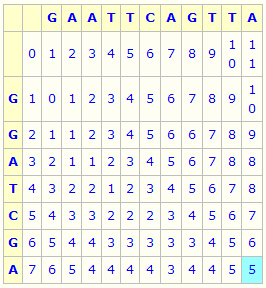
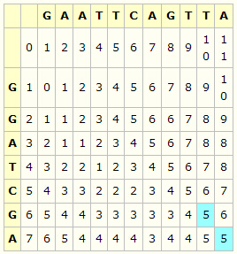
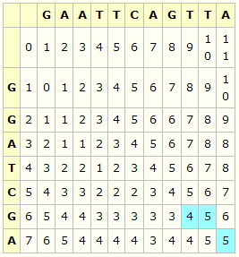

# LCS
举例说明：A=GGATCGA，B=GAATTCAGTTA  
* 初始化LD矩阵  
公式一  
若ai=bj，则LD(i,j)=LD(i-1,j-1)  
若ai≠bj，则LD(i,j)=Min(LD(i-1,j-1),LD(i-1,j),LD(i,j-1))+1  
  

* 利用上述的公式一，计算第一行  
  

* 利用上述的公示一，计算其余各行  
  

* 定位在矩阵的右下角  
  

* 回溯单元格，至矩阵的左上角  
若ai=bj，则回溯到左上角单元格  
  
若ai≠bj，回溯到左上角、上边、左边中值最小的单元格，若有相同最小值的单元格，优先级按照左上角、上边、左边的顺序  
  
若当前单元格是在矩阵的第一行，则回溯至左边的单元格  
若当前单元格是在矩阵的第一列，则回溯至上边的单元格  
  
依照上面的回溯法则，回溯到矩阵的左上角  

* 根据回溯路径，写出匹配字串  
若回溯到左上角单元格，将ai添加到匹配字串A，将bj添加到匹配字串B  
若回溯到上边单元格，将ai添加到匹配字串A，将_添加到匹配字串B  
若回溯到左边单元格，将_添加到匹配字串A，将bj添加到匹配字串B  
搜索晚整个匹配路径，匹配字串也就完成了  
A：GGA_TC_G__A  
B：GAATTCAGTTA  

# ScreenShot
* Folder comparison  

* Text comparison  

# Release
[download](https://github.com/skypanda100/qt-diff/releases)
